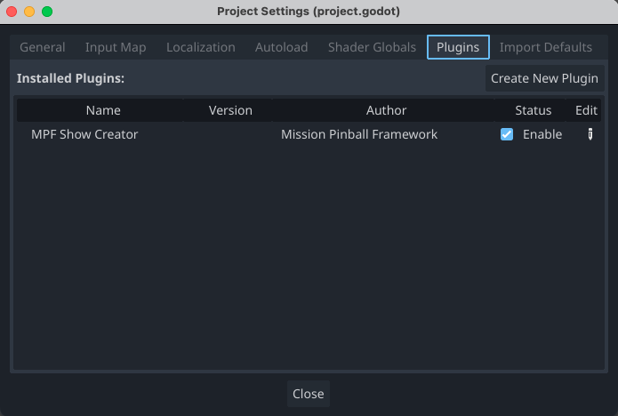
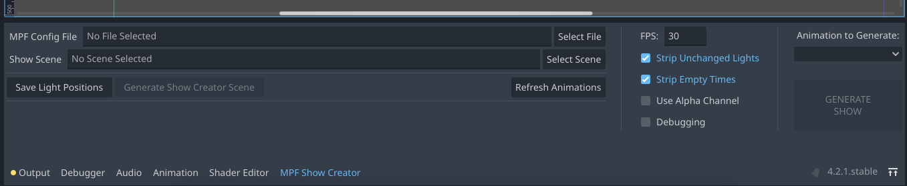
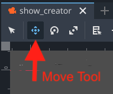
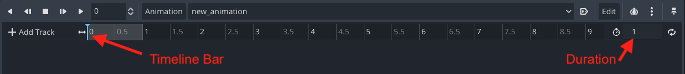

# Godot MPF GMC Toolbox

The Godot MPF GMC Toolbox is a collection of tools for previewing playfield behavior and generating pinball light shows on machines running the Mission Pinball Framework.

# Installation and Setup

To use this tool, you will need an image of your playfield and the Godot editor version 4.3 or later (download from [godotengine.org](https://godotengine.org)).

Download a ZIP of this repository from the [main repository page](https://github.com/missionpinball/gmc-toolkit) by clicking the green **Code** button and *Download ZIP*. Extract the ZIP file and copy the */addons/gmc-toolbox/* folder into your project's */addons/* folder

Or, clone this repository to your machine and symlink the */addons/gmc-toolbox/* folder in your project's */addons/* folder.

Open your GMC project in Godot and under **Project Settings > Plugins** enable the GMC Toolbox plugin. You may see a slew of warnings and errors, don't worry about it. Restart the Godot editor and there should be no errors.

## Create your Playfield Scene

Create a new folder in your project, e.g. */monitor*, and copy your playfield image there. Then in the Godot file panel, create a new Scene in that folder. For the Root Type, click on the tree icon and choose `GMCPlayfield`. Save your scene (a good name is *playfield.tscn*).

Open your playfield scene in the scene editor and select the root `GMCPlayfield` node. In the inspector panel, under **GMCPlayfield > Monitor Size** set the dimensions you would like the Monitor to run at (should be the same aspect ratio as your plafield image) Under **TextureRect > Texture** select your playfield image.

Save and close this scene.

## Initialize Your Scene

At the bottom panel of the Godot editor select the new tab called *GMC Toolbox* to open up the GMC Toolbox panel.

Find the input box for *MPF lights: Config File* and select the yaml file from your MPF project that includes the `lights:` definition for the lights in your machine. Do the same for the *MPF switches: Config File* with the yaml file that includes the `switches:` definition for your machine. (These may be the same file, though it's recommended to separate them).

In the input row for *GMCPlayfield Scene*, select the playfield scene you created in the previous step.

After setting the yaml files, click on the "*Generate Lights to Playfield Scene*" button to populate a collection of `GMCLight` nodes in your playfield scene.

## Arrange Lights

The Toolbox generated special light nodes for each light it found in the MPF YAML config. You will see them all in the *Scene* panel (upper left) with a warning icon to indicate that they have not been positioned yet.

At the top of the scene editor window, select the crosshair cursor for the "Move Mode" tool (instead of the default "Select Mode"). Click on a light node in the *Scene* panel. In the main view you'll see an orange box with crosshairs highlighting the light. Drag the box to its appropriate position over the playfield image.

Once a light has been moved, the warning icon will disappear. Proceed through all of the lights and position them across the playfield. You may also customize each light by selecting a shape and size (in inches), and well as rotation.

When all lights are positioned, save your scene.

## Arrange Switches

In the GMC Toolbox panel, click on the "*Generate Switches to Playfield Scene*" button to populate a collection of `GMCSwitch` nodes in your playfield scene. Follow the same process as the lights to position the new switch nodes in the appropriate places on your playfield.

You can customize a switch's base color (color when inactive) and active color. You can also use *BaseButton > Toggle Mode* if you want the switch to toggle state instead of activate-and-deactivate on click-and-release.

# MPF Monitor

You can now use the MPF Monitor feature of GMC Toolbox to interact with switches and see light shows during gameplay. From the GMC Toolbox panel click on the **Launch Monitor** button to launch the monitor. You should see a new window appear (at the dimensions specified on your playfield node) with your playfield image, lights, and switches.

In your terminal, launch MPF, and from the Godot editor, launch your GMC project as usual. You can now use the Monitor window to hit switches, and see the lights change color.

# Show Creator

You can use your playfield scene to create light show animations. Open your playfield scene and add a new `AnimationPlayer` node as a direct child of the `GMCPlayfield` node. Select the playfield root node and in the Inspector under *GMCPlayfield > Animation Player* select the `AnimationPlayer` node you just created.

## Create Shapes for Animating

Now it's time to create shapes and animate them over the playfield. You can use Godot's built-in `ColorRect` for a colored rectangle or `TextureRect` to create a *GradientTexture* for making gradients.

This project also includes a number of pre-made shapes in the */show-creator/shapes* folder, or you're welcome to add your own shapes, images, or even videos.

Select the shape/image you want to use and drag it onto the playfield. Scale it to the size and starting position you'd like. Select the shape node in the *Scene* panel and look to the *Inspector* panel (upper right) and find the *Visibility* section. Click on the `Modulate` property to set the color of the shape.

### Single Color

You can quickly set a shape to be a single color with the *CanvasItem > Visibility > Modulate* property. This property overwrites the color values of the shape with white being transformed to the selected color and black not changing at all.

### Gradient

Create a `TextureRect` node in your scene and in the Insector click on the *Texture* dropdown and select `GradientTexture2D`. You will now see a gradient in the dropdown, click on it to expand the gradient preview.

Click on the horizontal *Gradient* section to expand the color selections, and select a point to set the color at that position. In the large square gradient above, you can use the white markers to adjust the angle and direction of the gradient.

You can then move and scale the `TextureRect` to position the gradient over the playfield.

## Create an Animation

For a nice tutorial on using animations in Godot, see the [Introduction to Animation Features](https://docs.godotengine.org/en/stable/tutorials/animation/introduction.html) walkthrough. It's a good idea to read through this guide before proceeding.

Select the `AnimationPlayer` node in the *Scene* panel and the *Animation* panel will open at the bottom of the editor. Click on *Animation* and select *New*. Enter the name of the show you want to create and click OK.

The animation will default to be 1 second long, which you can change by entering the duration (in seconds) to the right of the clock icon on the timeline.

Set your shape(s) to their initial position and size, and create keyframes for those properties (i.e. if you are going to animate position, you will need position keyframes, and if you are animating size, you will also need size keyframes).

Some properties that you may want to animate:

* Transform > Position
* Transform > Rotation
* Transform > Scale
* Visibility > Modulate (to animate the color)

To create a keyframe, set the shape properties how you want them and in the *Inspector* panel, click on the key icon next to any property you want to animate.

*Note: The first time your add a keyframe to an animation, you will get a prompt. Select Bezier Curves only if you intend to do advanced easing between keyframes. Deselect* Create RESET Track(s) *as you won't need them for Show Creator.*

In the *Animation* panel, drag the blue timeline handle to the time of the next keyframe you want to create. Move your shape(s) to the desired position, and click on the key icon again.

Repeat this process for all shapes and properties you want to animate for the show. You can preview the animation at any time by pressing the Play icon in the top left of the *Animation* panel.

## Render Your Show

When your animation is ready, save your scene and return to the *MPF Show Creator* panel. Click on the *Refresh Animations* button to get the animations you just created (if the button doesn't work, make sure you've saved the scene).

In this panel there are some options to customize the show. It's recommended to strip unchanged and empty values, to keep the show size down. A higher FPS will produce smoother transitions, especially for gradients, but will have more steps and require more processor overhead to render.

On the right side of the *MPF Show Creator* panel, select the animation you wish to generate a show for and click on the orange *Generate Show* button.

*NOTE: You must have a /shows folder in your project root because that's where Show Creator is going to make the file and I haven't gotten around to checking for/creating/choosing the show destination folder.*

Show Creator will pop up a window and run the animation quickly, and then close the window. A YAML file with the animation name will be saved in your project root's */shows* folder ready to use in MPF!
